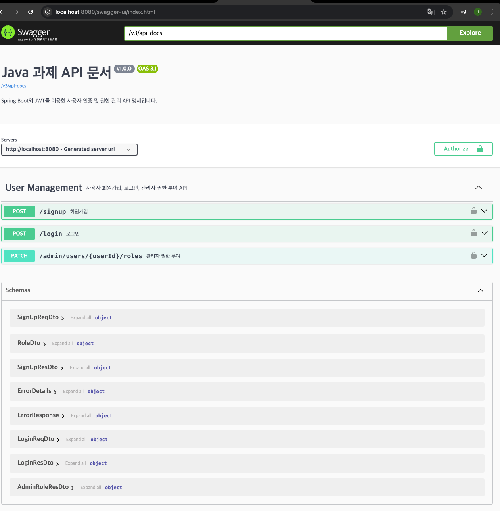

# Spring Boot JWT 인증/인가 백엔드 과제

간결하고 실전적인 사용자 인증/인가 API 백엔드 예제입니다.
Spring Boot, JWT, JUnit, Swagger(OpenAPI), AWS EC2 배포까지 모두 경험할 수 있습니다.

## 프로젝트 소개
기술스택: Java 24, Spring Boot 3.x, Spring Security, JWT, JUnit, Swagger (springdoc-openapi)


## 주요 목적
회원가입/로그인/관리자 권한 부여 API 구현
JWT 기반 인증/인가
Swagger UI로 API 문서 자동화
AWS EC2 배포 실습
데이터 저장: 인메모리(별도 DB/파일 미사용)

## 주요 기능
회원가입: 사용자 등록, 중복 체크
로그인: JWT Access Token 발급
관리자 권한 부여: ADMIN 역할 부여 (ADMIN만 가능)
JWT 인증/인가: 토큰 서명, 만료, 권한 검증
API 문서화: Swagger UI 제공

## Swagger UI 접속
http://localhost:8080/swagger-ui.html


markdown
# 프로젝트 실행 방법 및 API 명세

## 프로젝트 실행 방법

### 1. 환경 준비

- Java 17 이상 (Java 24 지원)
- Gradle 또는 Maven 빌드 도구

### 2. 빌드 및 실행

- **Gradle 사용 시**
  ```
  ./gradlew build
  java -jar build/libs/your-app.jar
  ```

- **Maven 사용 시**
  ```
  mvn clean package
  java -jar target/your-app.jar
  ```

### 3. 기본 서버 주소
- http://0.0.0.0:8080 (포트 변경 불가)

### 4. 테스트 실행
- **Gradle**
  ```
  ./gradlew test
  ```

- **Maven**
  ```
  mvn test
  ```

---

## API 명세

### 1. 회원가입

- **URL:** `/signup`
- **Method:** POST
- **Request Body:**
  ```
  {
  "username": "JIN HO",
  "password": "12341234",
  "nickname": "Mentos"
  }
  ```
- **성공 응답:**
  ```
  {"username": "JIN HO",
   "nickname": "Mentos",
   "roles": [
     { "role": "USER" }
   ]
  }
  ```
  - **실패 응답 (이미 가입된 사용자):**
    ```
    {"error": {
        "code": "USER_ALREADY_EXISTS",
        "message": "이미 가입된 사용자입니다."}}
    ```

---

### 2. 로그인

- **URL:** `/login`
- **Method:** POST
- **Request Body:**
  ```
  {
  "username": "JIN HO",
  "password": "12341234"
  }
  ```
- **성공 응답:**
  ```
  {
  "token": "JWT_ACCESS_TOKEN"
  }
  ```
  - **실패 응답 (잘못된 정보):**
    ```
    {
    "error": {
        "code": "INVALID_CREDENTIALS",
        "message": "아이디 또는 비밀번호가 올바르지 않습니다."
        }
    }
    ```

---

### 3. 관리자 권한 부여

- **URL:** `/admin/users/{userId}/roles`
- **Method:** PATCH
  - **Path Variable:** `userId` (예: `/admin/users/15/roles`)
  - **성공 응답:**
    ```
    {
    "username": "JIN HO",
    "nickname": "Mentos",
    "roles": [
        { "role": "ADMIN" }
     ]
    }
    ```
  - **실패 응답 (권한 부족):**
  
  ```
      {
      "error": {
        "code": "ACCESS_DENIED",
        "message": " 접근 권한이 없습니다."}
  }
    ```

---

### 4. JWT 토큰 사용 및 인증

- 로그인 성공 시 JWT Access Token이 발급됩니다.
- 보호된 API 요청 시 `Authorization: Bearer [토큰]` 헤더에 토큰을 포함해야 합니다.
- 토큰이 유효하지 않거나 만료된 경우:
  ```
    {
    "error": {
      "code": "INVALID_TOKEN",
      "message": "유효하지 않은 인증 토큰입니다."
     }
    }